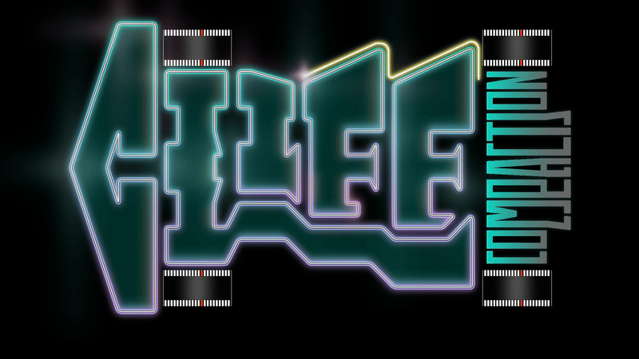

<p align="center">
  
</p>

# CliffCompaction

Autocompaction for coding agents, as a transparent API proxy. Point an agent's base URL at it and long sessions stay under a token budget — the agent is unchanged and unaware.

## Quick start

```bash
uv tool install cliffcompaction        # or: pip install cliffcompaction
```

Or, from a clone:

```bash
uv tool install --force --editable .   # or: pip install -e .
```

Then start the proxy — this adds the base-URL variables to your shell profile and installs a background service (launchd on macOS, systemd --user on Linux):

```bash
cliff enable                           # defaults to Claude Code
```

Open a new terminal and run your agent as usual — `claude`, or anything reading those variables.

Other commands:

- `cliff status` — health.
- `cliff restart` — picks up an upgrade, keeping the daemon's flags. A running daemon keeps serving the code it started with, so an upgrade changes nothing until you restart; `cliff status` warns when that has happened.
- `cliff watch` — live view of requests, matches and compactions (recommended for Claude Code and Codex CLI; other scaffolds compact normally, but the watch display may mislabel).
- `cliff disable` — reverses everything.


## More than one daemon

For a second provider, or a different threshold per client. Each instance gets its own port, flags and log; `status`, `restart`, `watch` and `disable` all take `--name`:

```bash
cliff enable --name kimi --port 8305 --anthropic-upstream https://api.kimi.com/coding
```

Named instances don't touch your shell env — point the client at the port yourself:

```bash
ANTHROPIC_BASE_URL=http://127.0.0.1:8305 claude
```


### Codex CLI

Codex routes by config file rather than an env var, so it needs a provider block in `~/.codex/config.toml`:

```bash
cliff enable --name codex --port 8448 --openai-upstream https://chatgpt.com
```

```toml
model_provider = "cliff"    # top-level key: must go above the first [table] header

[model_providers.cliff]
name = "OpenAI via cliff"
base_url = "http://127.0.0.1:8448/backend-api/codex"
wire_api = "responses"
requires_openai_auth = true
```


## One session without the proxy

Drop the env var for a single process:

```bash
env -u ANTHROPIC_BASE_URL claude    # OpenAI-side clients: -u OPENAI_BASE_URL -u OPENAI_API_BASE
```

Codex has no env var to unset — override the key instead:

```bash
codex -c model_provider=openai      # and again on resume: ... resume --last
```


## Without installing a daemon

A proxy on a free port, env set for that command only, torn down after:

```bash
cliff run -- claude
cliff run --shadow -- claude        # observe-only: logs what it would compact, changes nothing
```

`--shadow` also works on `cliff enable` — useful to confirm a scaffold's history is prefix-stable before going active.

Or run the server yourself:

```bash
cliff serve --port 8257 --threshold 200000 --keep-recent 3
export ANTHROPIC_BASE_URL=http://127.0.0.1:8257
export OPENAI_BASE_URL=http://127.0.0.1:8257/v1
```

**Important:** disable your scaffold's own compaction. Under the proxy it sees small prompt counts, so its triggers generally won't fire anyway — but some rewrite history in place, which breaks the prefix matching CliffCompaction relies on.

<details>
<summary><h2>How it works</h2></summary>

Every request an agent sends is `history + latest step`. The proxy:

1. Canonicalizes and hashes each message, forming a hash chain.
2. If the outgoing size exceeds the threshold, it rebuilds the history as `[head verbatim] + [one CliffCompaction summary message] + [last keep_recent turns verbatim]`, keyed by the original prefix's chain hash.
3. Later requests arrive with the original history. The proxy finds the longest stored prefix and substitutes the compacted version, forwarding `C + tail` instead of `S + tail`.
4. If the provider still rejects with a context-length error, the proxy compacts and replays once.

The summary is mechanical, built by content class:


| Content                             | Treatment                                                 |
| ----------------------------------- | --------------------------------------------------------- |
| Tool results                        | Kept verbatim iff ≤ 500 chars, dropped otherwise          |
| Tool calls                          | One-line signatures (name + truncated arguments)          |
| Assistant text & thinking           | Kept in full by default                                   |
| Human text                          | Verbatim in the current summary                           |
| Head (system + task) & recent turns | Untouched                                                 |
| Images                              | Dropped from summaries, verbatim in head and recent turns |


Re-compaction **drops** the previous summary.

**Fail-open contract:** any failure — unparseable body, no prefix match, store error — means verbatim passthrough.

</details>

<details>
<summary><h2>Configuration</h2></summary>


| Flag / env var                                      | Default                                                                       | Meaning                                                                                                             |
| --------------------------------------------------- | ----------------------------------------------------------------------------- | ------------------------------------------------------------------------------------------------------------------- |
| `--threshold` / `CLIFF_THRESHOLD_TOKENS`            | 200000                                                                        | compaction trigger, in estimated tokens. The default suits 1M-context models; on 200–250k ones use 100000–128000 |
| `--keep-recent` / `CLIFF_KEEP_RECENT`               | 3                                                                             | recent assistant-step turns kept verbatim                                                                           |
| `--thought-max-chars` / `CLIFF_THOUGHT_MAX_CHARS`   | 0 (unlimited)                                                                 | cap on assistant text in summaries                                                                                  |
| `--thinking-max-chars` / `CLIFF_THINKING_MAX_CHARS` | 0 (unlimited)                                                                 | cap on thinking text, independent of the thought cap                                                                |
| `--drop-thinking` / `CLIFF_KEEP_THINKING=0`         | keep                                                                          | exclude thinking/reasoning text from summaries                                                                      |
| `--result-max-chars` / `CLIFF_RESULT_MAX_CHARS`     | 500                                                                           | tool results longer than this are dropped                                                                           |
| `CLIFF_HUMAN_MAX_CHARS`                             | 20000                                                                         | sanity cap on human text in summaries                                                                               |
| `--anthropic-upstream` / `CLIFF_ANTHROPIC_UPSTREAM` | `https://api.anthropic.com`                                                   |                                                                                                                     |
| `--openai-upstream` / `CLIFF_OPENAI_UPSTREAM`       | `https://api.openai.com`                                                      |                                                                                                                     |
| `--shadow` / `CLIFF_SHADOW`                         | off                                                                           | observe-only mode                                                                                                   |
| `--strict` / `CLIFF_STRICT`                         | off                                                                           | fail a request still over threshold after compaction (HTTP 400) instead of sending it anyway — for measurement runs |
| `--debug-dir` / `CLIFF_DEBUG_DIR`                   | off                                                                           | dump each handled request's incoming/outgoing messages as JSON                                                      |


Supported dialects: **Anthropic Messages** (`/v1/messages`), **OpenAI Chat Completions** (`/chat/completions`) and **OpenAI Responses** (`/responses`), native tool calling. Everything else passes through verbatim, to the Anthropic upstream — or to the OpenAI one when that is the only upstream configured.

</details>

<details>
<summary><h2>Development</h2></summary>

Python 3.11+.

```bash
uv sync
uv run pytest
```

</details>

## Citation

Paper link and BibTeX to follow.

